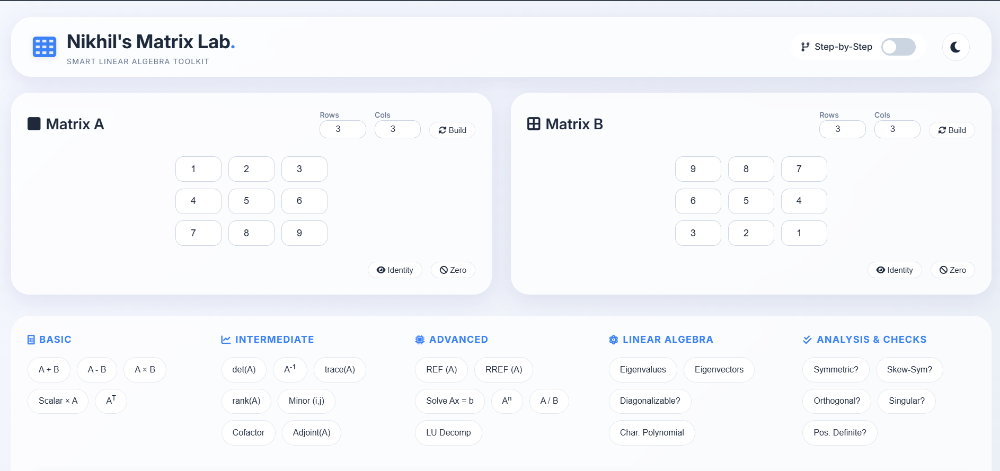
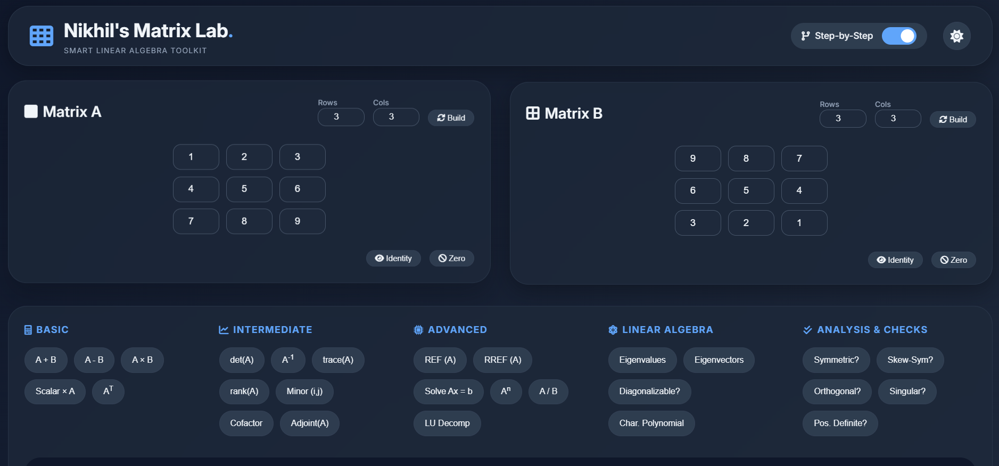

# Nikhil Matrix Studio

Advanced Matrix Calculator and Linear Algebra Toolkit built using HTML, CSS, and JavaScript.

A modern, responsive, and student-friendly web application designed to solve matrix problems ranging from basic operations to advanced linear algebra calculations.

<p align="center">
  
  
  
  
  
  
</p>

## Live Preview

https://nikhilmatrixstudio.netlify.app/
---

## Features

### Basic Matrix Operations
- Matrix Addition
- Matrix Subtraction
- Matrix Multiplication
- Scalar Multiplication
- Matrix Transpose

### Intermediate Operations
- Determinant
- Inverse Matrix
- Trace
- Rank
- Minor
- Cofactor
- Adjoint Matrix

### Advanced Operations
- REF (Row Echelon Form)
- RREF (Reduced Row Echelon Form)
- Gaussian Elimination
- Gauss-Jordan Method
- Solve Linear Equations
- Matrix Power
- Matrix Division
- LU Decomposition

### Linear Algebra Tools
- Eigenvalues
- Eigenvectors
- Characteristic Polynomial
- Diagonalization Check
- Matrix Type Detection

### Matrix Analysis
- Symmetric Matrix Check
- Skew-Symmetric Check
- Orthogonal Matrix Check
- Singular Matrix Detection
- Positive Definite Check

### User Experience
- Modern Responsive UI
- Student-Friendly Design
- Dark / Light Theme
- Step-by-Step Mode
- Error Handling
- Mobile Friendly Layout
- Accessible Controls

---

## Tech Stack

- HTML5
- CSS3
- JavaScript (Vanilla)
- Mathematical Algorithms

---

## Folder Structure

```text
matrix-calculator-pro/
│
├── index.html
├── style.css
├── script.js
├── README.md
└── assets/
```

---

## Screenshots

### Home Light\Dark Theme Preview
<p>
  
  </p>
<p>
  
</p>


---

## How to Run

1. Clone repository

```bash
git clone https://github.com/nikhil-mca-code/web-dev-projects.git
```

2. Open project folder

3. Run `index.html` in browser

No installation required.

---

## Learning Purpose

This project was built to explore:

- Matrix mathematics
- Linear algebra algorithms
- DOM manipulation
- JavaScript logic
- UI/UX design
- Frontend development

---

## Author

**Nikhil Singh**

Designed and developed as a frontend mathematical web application project.

---

## License

MIT License
